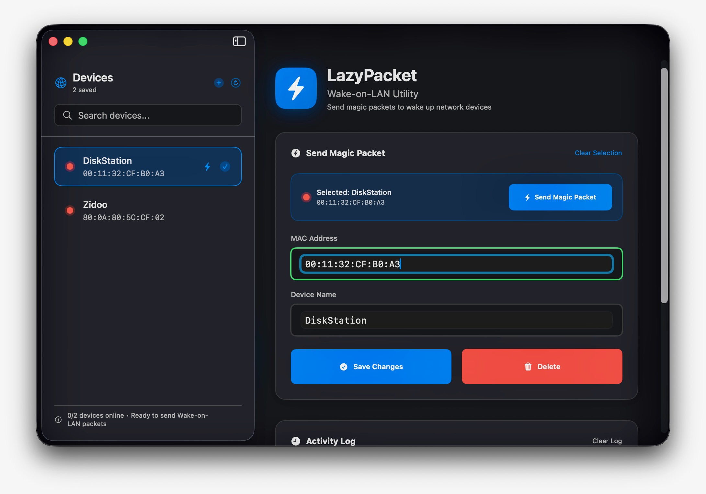

# LazyPacket

A clean, native macOS app for waking devices on your network with Wake-on-LAN magic packets.

<p align="center">
  
  
  
</p>

<p align="center">
  
</p>

## Features

- **One-click wake** — send a magic packet to any device instantly
- **Saved devices** — store and name your devices; click one to wake it
- **Live validation** — MAC addresses are checked as you type
- **Persistent** — your device list is saved automatically
- **Native** — built with AppKit, no dependencies

## Install

**Download:** grab the latest `LazyPacket.zip` from the [Actions](../../actions) artifacts, unzip, and move to `/Applications`. The build is unsigned, so on first launch right-click the app → **Open** (or run `xattr -cr LazyPacket.app`).

**From source:**
```bash
git clone https://github.com/MadZimbo/LazyPacket.git
cd LazyPacket
open LazyPacket.xcodeproj   # then build & run with ⌘R
```

## Usage

1. Enter a MAC address (`AA:BB:CC:DD:EE:FF`) and an optional name, then **Add Device**.
2. Select a saved device — or type a MAC directly — and click **Send Magic Packet**.

> Target devices must have Wake-on-LAN enabled in their BIOS/UEFI and be connected to the same network.

## License

MIT
